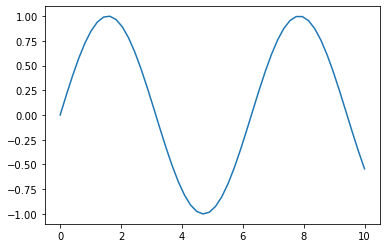

## Welcome to Numerical Methods

# Module Handbook for Numerical Methods (MTH3007M)

this document sets out the aims of the module, learning objectives and provides some use background material and suggestions.


### Module synopsis

"The module equips the students with knowledge of various numerical methods for solving applied mathematics problems, their algorithms and implementation in  programming languages."

## Overview

- Learning objectives
- Assessment
- Deadlines
- Books
- Contents
- Room Policy


## Learning Objectives

- LO1: Apply numerical methods for curve fitting and solving various equations.

- LO2:Critically analyse applied mathematical problems, choose and apply appropriate numerical methods for their solution.

- LO3: Implement numerical solutions in efficient computer codes using a high level computer language.


## Assessments

This module will have two types of assessment

- formative weekly short questions
- Time Controlled Assessment assignments

***Weekly short assessments*** will be marked on a very simple scheme to allow rapid feedback:
    
- 100 for a correct answer
- 50 for an incorrect answer with substantial correct working displayed and a reasonable demonstration of understanding the question material similar to a logbook entry for the question.
- 0 for an incorrect answer without supporting material

Feedback will be provided in partially worked solutions that will be presented in the tutorial session. There will be time in the workshop sessions to get extra feedack from  the lecturers and demonstrators on your work.

***Time Controlled Assessment assignments*** will consist of mini projects to be tackled over a period of a few days e.g. construct a predictive model from this data using methods you have seen in the module. They will be marked on an extended rubric detailing requirements for each degree classification:

- Clear explanation of the problem addressed in mathematical terms
- Explanation of the choice of method applied
- Details of the numerical method implementation in your chosen language
- Quality of the code - including comments, and testing.
- Presentation of results and analysis 

A full rubric will be provided and examples given leading up to the TCA.

## Deadlines

Weekly short questions will be opened to you in the Monday session on the material covered in the online lecture. They should be submitted online by 3 the following Monday. This will allow feedback to be given in the following sessions.

There will be two time constrained assessments assignments. The first semester TCA will be on 19th Jan 2021.

## Logbooks

Logbooks will not be directly assessed in this module.

**BUT** we reallly do recommend that you keep a logbook for your own benefit. It is good professional practice and ...

you can use your logbooks in Time Controlled Assessments.

Alos, when submitting work you should attach evidence of your working, which would be very similar to relevant pages from your logbook.

## Module Contents 

- Curve fitting. 
- Numerical solution of non-linear equations.
- Numerical solution of ordinary differential equations. 
- Solving systems of equations.
- Numerical solution of partial differential equations.
- Elements of stochastic methods.


## Tools

in principle you can use any high level programming language as the focus is on understanding the numerical methods not the computing.

- we recommend and support the use of C++ or Python
- To work with C++ you can use MS Visual Studio which is installed in the computer labs and also is freely downloadable from [here](https://visualstudio.microsoft.com/). There are many other options and depending on the power of your computer and operating system there may be better options - ask us. 
- to work with Python I recommend Anaconda python which can be downloaded from [here](https://www.anaconda.com/products/individual) - click on the download button then pick the correct installer. I like using Jupyter notebooks – see the notebooks on Blackboard for reminder on how to use them - but there are many other nice working environments.  

You can use either of these languages – it would be very beneficial for you to see what parts are essential and what are trivial details of a particular language to try and use both. Would be good for your CV too.


```python
import numpy as np
x = np.linspace(0,10)
y = np.sin(x)
```


```python
import matplotlib.pyplot as plt
plt.plot(x,y);
```





```python

```

[Module Handbook](web/ModuleHandbook.jl.html)

[Lecture 1](https://mattatlincoln.github.io/teaching/numerical_methods/lecture_1)

[Lecture 2](https://mattatlincoln.github.io/teaching/numerical_methods/lecture_2)

[Lecture 3](https://mattatlincoln.github.io/teaching/numerical_methods/lecture_3)

[Lecture 4](https://mattatlincoln.github.io/Numerical-Methods-2223/lectures/Lecture4.jl.html)

[Lecture 5](https://mattatlincoln.github.io/teaching/numerical_methods/lecture_5)

[Lecture 6](https://mattatlincoln.github.io/teaching/numerical_methods/lecture_7)

[Lecture 8](https://mattatlincoln.github.io/teaching/numerical_methods/lecture_8)

[Lecture 8](https://mattatlincoln.github.io/teaching/numerical_methods/lecture_10)
