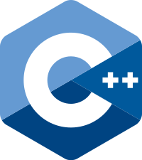
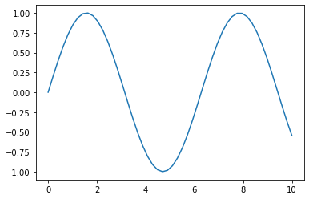

## Welcome to Numerical Methods

# Module Handbook for Numerical Methods (MTH3007M)

this document sets out the aims of the module, learning objectives and provides some use background material and suggestions.


### Module synopsis

"The module equips the students with knowledge of various numerical methods for solving applied mathematics problems, their algorithms and implementation in  programming languages."

## Overview

- Learning objectives
- Assessment
- Deadlines
- Logbooks
- Contents
- Tools


## Learning Objectives

- LO1: Apply numerical methods for curve fitting and solving various equations.

- LO2:Critically analyse applied mathematical problems, choose and apply appropriate numerical methods for their solution.

- LO3: Implement numerical solutions in efficient computer codes using a high level computer language.


## Assessments

This module will have two in-class exams - at the end of each semester (100% of total mark, 50% for each test).
The questions will be in a similar spirit to the weekly exercises. They will be a mixture of previously seen problems and problem solving exercises.

## Deadlines

Weekly short questions will be based on the lecture materials of the sessions before they are set. You should attempt these and discuss with lecturers and demonstrators toallow feedback to be given in the following sessions.

There will be two in-class tests.

## Logbooks

Logbooks will not be directly assessed in this module.

**BUT** we reallly do recommend that you keep a logbook for your own benefit. It is good professional practice and ...

you can use your logbooks in in-class tests.

Also, when submitting work you should attach evidence of your working, which would be very similar to relevant pages from your 'logbook'.

## Module Contents 

- Curve fitting. 
- Numerical solution of non-linear equations.
- Numerical solution of ordinary differential equations. 
- Solving systems of equations.
- Numerical solution of partial differential equations.
- Elements of stochastic methods.

## Tools

in principle you can use any high level programming language as the focus is on understanding the numerical methods not the computing.

- we highly recommend that you use Python for this course
- I'll be using the installed python and VS Code on a machine identical to those on the desks in the lab
- to work with Python on your own computer I recommend Anaconda python which can be downloaded from [here](https://www.anaconda.com/products/individual) - click on the download button then pick the correct installer. I like using Jupyter notebooks – see the notebooks on Blackboard for reminder on how to use them - but there are many other nice working environments.  
- To work with C++ you can use MS Visual Studio which is installed in the computer labs and also is freely downloadable from [here](https://visualstudio.microsoft.com/). There are many other options and depending on the power of your computer and operating system there may be better options - ask us. 

You can use either of these languages – it would be very beneficial for you to see what parts are essential and what are trivial details of a particular language to try and use both. Would be good for your CV too.

```python
import numpy as np
x = np.linspace(0,10)
y = np.sin(x)
```


```python
import matplotlib.pyplot as plt
plt.plot(x,y);
```





```python

```
1st semester Lectures:

[Lecture 1](https://mattatlincoln.github.io/teaching/numerical_methods/lecture_1)

[Lecture 2](https://mattatlincoln.github.io/teaching/numerical_methods/lecture_2)

[Lecture 3](https://mattatlincoln.github.io/teaching/numerical_methods/lecture_3)

[Lecture 4](https://mattatlincoln.github.io/Numerical-Methods-2223/lectures/Lecture4.jl.html)

[Lecture 5](https://mattatlincoln.github.io/teaching/numerical_methods/lecture_5)

[Lecture 6](https://mattatlincoln.github.io/teaching/numerical_methods/lecture_7)

[Lecture 8](https://mattatlincoln.github.io/teaching/numerical_methods/lecture_8)

[Lecture 10](https://mattatlincoln.github.io/teaching/numerical_methods/lecture_10)
